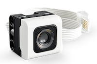

ColorSensor
===========

|location_link|

.. |location_link| raw:: html

   <a href="https://education.lego.com/en-gb/products/lego-technic-color-sensor/45605" target="_blank">LEGO Color Sensor 45605</a>

|location_link2|

.. |location_link2| raw:: html

   <a href="https://www.bricklink.com/v2/catalog/catalogitem.page?S=45605-1#T=S&O={%22iconly%22:0}" target="_blank">BrickLink item</a>

The LEGO® Education SPIKE™ Color Sensor can sort between eight different colors and can measure reflected and ambient or natural light. 

.. autoclass:: buildhat.ColorSensor
   :members:
   :inherited-members:

Example
-------

.. literalinclude:: color.py

