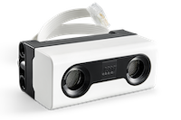

DistanceSensor
==============

|location_link|

.. |location_link| raw:: html

   <a href="https://education.lego.com/en-gb/products/lego-technic-distance-sensor/45604" target="_blank">LEGO Distance Sensor 45604</a>

|location_link2|

.. |location_link2| raw:: html

   <a href="https://www.bricklink.com/v2/catalog/catalogitem.page?S=45604-1#T=S&O={%22iconly%22:0}" target="_blank">BrickLink item</a>

The LEGO® Education SPIKE™ Distance Sensor behaves like a conventional ultrasonic range finder but also has four LEDs that can be used to create the "eyes" of a robot. Each LED can be controlled individually.

.. autoclass:: buildhat.DistanceSensor
   :members:
   :inherited-members:

Example
-------

.. literalinclude:: distance.py
