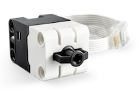

ForceSensor
===========

|location_link|

.. |location_link| raw:: html

   <a href="https://education.lego.com/en-gb/products/lego-technic-force-sensor-by-lego-education/45606" target="_blank">LEGO® Force Sensor Set 45606e</a>

|location_link2|

.. |location_link2| raw:: html

   <a href="https://www.bricklink.com/v2/catalog/catalogitem.page?P=37312c01#T=C&C=11" target="_blank">BrickLink item</a>

The LEGO® Education SPIKE™ Prime Force Sensor (also known as the LEGO® Technic Force Sensor) can measure pressure of up to 10 newtons (N), but it can also be used as a touch sensor or a simple button.

.. autoclass:: buildhat.ForceSensor
   :members:
   :inherited-members:

Example
-------

.. literalinclude:: force.py

