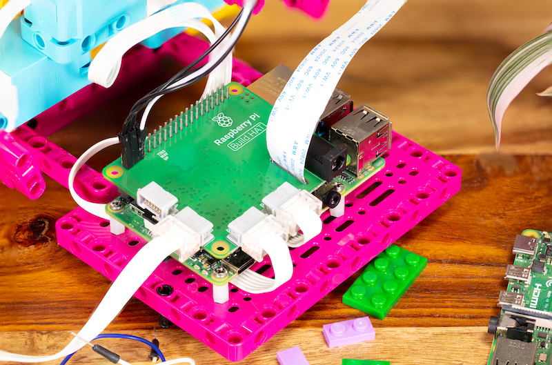
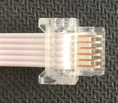

================
 Build HAT
================

.. _buildhat_lib:

Library
=======

The Build HAT library has been created to support the `Raspberry Pi Build HAT`_, 
an add-on board for the Raspberry Pi computer, which allows control of up to four LEGO® TECHNIC™ motors and sensors included in the SPIKE™ Portfolio.

.. _Raspberry Pi Build HAT: http://raspberrypi.com/products/build-hat

Other LEGO® devices may be supported if they use the PoweredUp connector:

In order to drive motors, your Raspberry Pi and Build HAT will need an external 7.5V
power supply. For best results, use the `official Raspberry Pi Build HAT power supply`_. 

.. _official Raspberry Pi Build HAT power supply: http://raspberrypi.com/products/build-hat-power-supply

It is now possible to use custom firmware with the library. To do this you can follow the steps below.

.. code-block::
   :caption: Using custom firmware

      sudo apt install cmake python3 build-essential gcc-arm-none-eabi libnewlib-arm-none-eabi libstdc++-arm-none-eabi-newlib

      git clone https://github.com/raspberrypi/pico-sdk.git --recursive
      git clone https://github.com/raspberrypi/buildhat.git --recursive

      cd buildhat
      export PICO_SDK_PATH="$(pwd)/../pico-sdk/"
      make

      cd ..
      mkdir test
      cd test
      mkdir data

      cp ../buildhat/firmware-pico/build/main.bin data/firmware.bin
      cp ../buildhat/bhbl-pico/signature.bin data/signature.bin
      cat ../buildhat/firmware-pico/version.h | sed 's/#define FWVERSION "//g; s/ .*//g' > data/version

Then place your script, such as the following, within the test/ directory.

.. code-block::
   :caption: Create test.py in test directory

      import time
      from buildhat import Motor

      m = Motor('A')
      m.start()

      time.sleep(5)

Then use: ``python test.py`` in the test directory, to run your script with your custom firmware.

Note if you want python to always reload the firmware from your **data/** directory each time
you run your script, simply write the value: -1 to **data/version**.

.. warning::

   The API for the Build HAT is undergoing active development and is subject
   to change.

.. toctree::
   :maxdepth: 2
  
   colorsensor.rst
   colordistancesensor.rst
   distancesensor.rst
   forcesensor.rst
   light.rst
   matrix.rst
   motionsensor.rst
   motor.rst
   motorpair.rst
   passivemotor.rst
   tiltsensor.rst
   hat.rst
