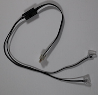

Light
===========

|location_link|

.. |location_link| raw:: html

   <a href="https://www.lego.com/en-gb/product/light-88005" target="_blank">LEGO® Light 88005</a>

|location_link2|

.. |location_link2| raw:: html

   <a href="https://www.bricklink.com/catalogItemInv.asp?S=88005-1" target="_blank">BrickLink item</a>

The LEGO® 88005 Powered Up Light features 2 LED lights, connecting wire and connection point for LEGO® Powered Up components.

.. autoclass:: buildhat.Light
   :members:
   :inherited-members:

Example
-------

.. literalinclude:: light.py

