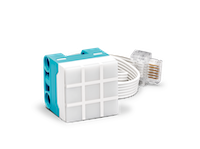

Matrix
======

The LEGO® SPIKE™ 3x3 LED matrix has individual elements that can be set individually or as a whole.

Colours may be passed as string or integer parameters. 

.. list-table:: LED Matrix colours
   :widths: 10 20
   :header-rows: 1

   * - Number
     - Name
   * - 0
     - 
   * - 1
     - pink
   * - 2
     - lilac
   * - 3
     - blue
   * - 4
     - cyan
   * - 5
     - turquoise
   * - 6
     - green
   * - 7
     - yellow
   * - 8
     - orange
   * - 9
     - red
   * - 10
     - white

.. autoclass:: buildhat.Matrix
   :members:
   :inherited-members:

Example
-------

.. literalinclude:: matrix.py
