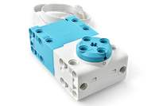
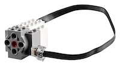
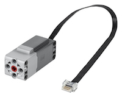
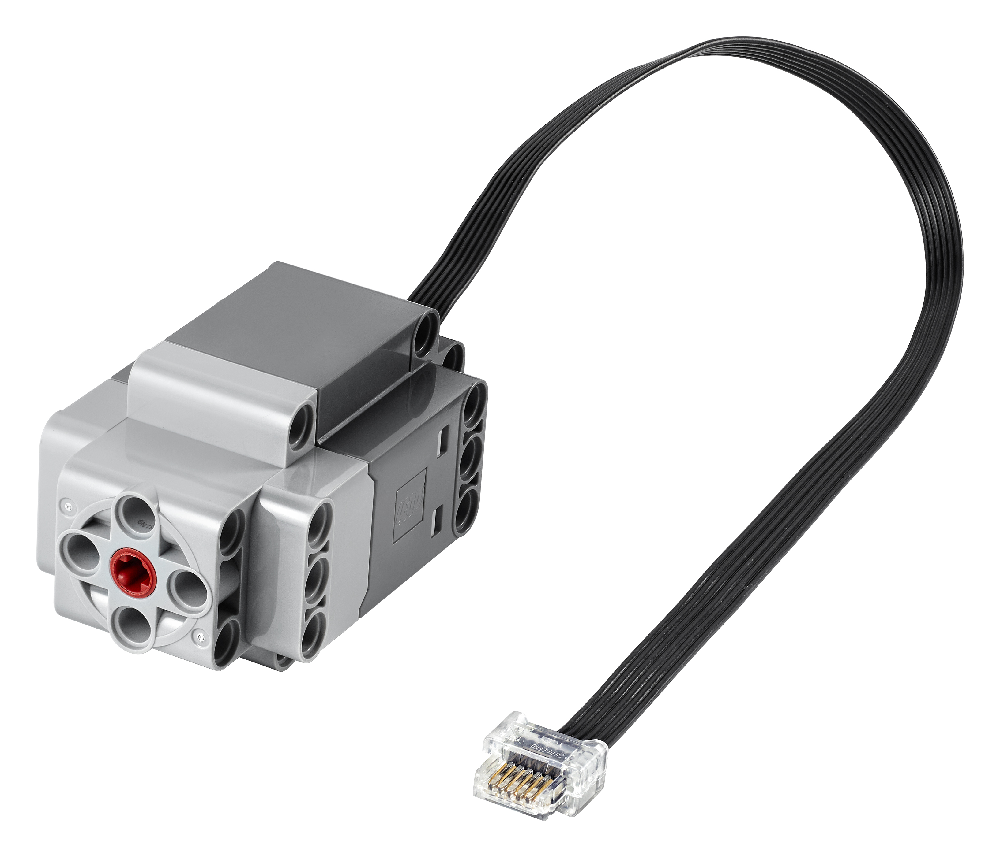

Motor
=====

LEGO® TECHNIC™ motors from the LEGO® Education SPIKE™ portfolio have an integrated rotation sensor (encoder) and can be positioned with 1-degree accuracy. The encoders can be queried to find the current position of the motor with respect to a 'zero' mark shown on the motor itself. 

.. |location_link1| raw:: html

   <a href="https://education.lego.com/en-gb/products/lego-technic-large-angular-motor/45602" target="_blank">LEGO® Large angular motor 45602</a>

.. |location_link1b| raw:: html

   <a href="https://www.bricklink.com/v2/catalog/catalogitem.page?S=45602-1#T=S&O={%22iconly%22:0}" target="_blank">BrickLink item 45602</a>

.. |location_link2| raw:: html

   <a href="https://education.lego.com/en-gb/products/lego-technic-medium-angular-motor/45603" target="_blank">LEGO® Medium angular motor 45603</a>

.. |location_link2b| raw:: html

   <a href="https://www.bricklink.com/v2/catalog/catalogitem.page?S=45603-1#T=S&O={%22iconly%22:0}" target="_blank">BrickLink item 45603</a>

.. |MAM| image:: images/45603_prod_TECHNIC_Medium_Angular_Motor_01_200.png
   :width: 200
   :alt: The LEGO Medium Angular Motor

.. |SAM| image:: images/45607_Prod_01_200.png
   :width: 200
   :alt: The LEGO Small Angular Motor

.. list-table:: Motors with encoders
   :widths: 50 50 200
   :header-rows: 0

   * - |location_link1|
     - |location_link1b|
     - |LAM|
   * - |location_link2|
     - |location_link2b|
     - |MAM|
   * - LEGO® Small angular motor 45607
     - 
     - |SAM|

Other motors without encoders will report a 0 value if queried.

.. |location_link3| raw:: html

   <a href="https://www.lego.com/en-gb/product/medium-linear-motor-88008" target="_blank">LEGO® Medium Linear motor 88008</a>

.. |location_link3b| raw:: html

   <a href="https://www.bricklink.com/v2/catalog/catalogitem.page?S=88008-1#T=S&O={%22iconly%22:0}" target="_blank">BrickLink item 88008</a>

.. |location_link4| raw:: html

   <a href="https://www.lego.com/en-gb/product/technic-large-motor-88013" target="_blank">Technic™ Large Motor 88013</a>

.. |location_link4b| raw:: html

   <a href="https://www.lego.com/en-gb/product/technic-large-motor-88013" target="_blank">BrickLink item 88013</a>

.. |location_link5| raw:: html

   <a href="https://www.lego.com/en-gb/product/technic-xl-motor-88014" target="_blank">Technic™ XL Motor 88014</a>

.. |location_link5b| raw:: html

   <a href="https://www.bricklink.com/v2/catalog/catalogitem.page?S=88014-1#T=S&O={%22iconly%22:0}" target="_blank">BrickLink item 88014</a>

.. list-table:: Motors without encoders
   :widths: 50 50 200
   :header-rows: 0

   * - |location_link3|
     - |location_link3b|
     - |M88008|
   * - |location_link4|
     - |location_link4b|
     - |M88013|
   * - |location_link5|
     - |location_link5b|
     - |M88014|

.. autoclass:: buildhat.Motor
   :members:
   :inherited-members:

Example
-------

.. literalinclude:: motor.py

