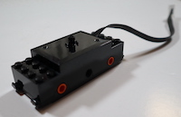

PassiveMotor
============

LEGO® TECHNIC™ motors which do not have an integrated rotation sensor (encoder).
 

.. |location_link1| raw:: html

   <a href="https://www.lego.com/en-gb/product/train-motor-88011" target="_blank">LEGO® Train motor 88011</a>

.. |location_link1b| raw:: html

   <a href="https://www.bricklink.com/catalogItemInv.asp?S=88011-1" target="_blank">BrickLink item 88011</a>

.. list-table:: Passive Motors 
   :widths: 50 50 200
   :header-rows: 0

   * - |location_link1|
     - |location_link1b|
     - |LTM|

.. autoclass:: buildhat.PassiveMotor
   :members:
   :inherited-members:

Example
-------

.. literalinclude:: passivemotor.py

